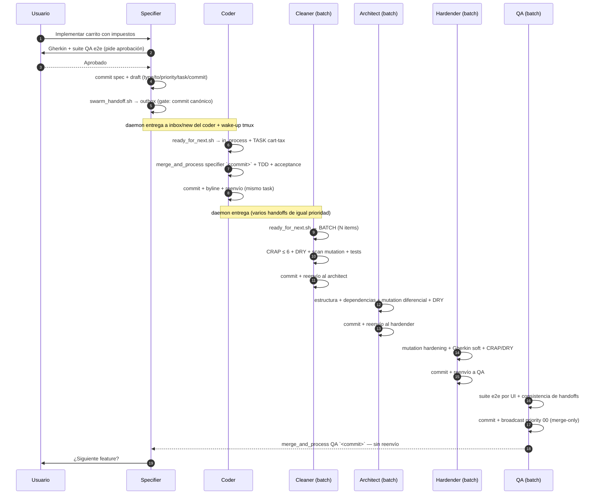
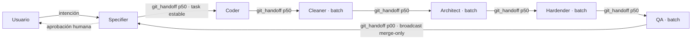
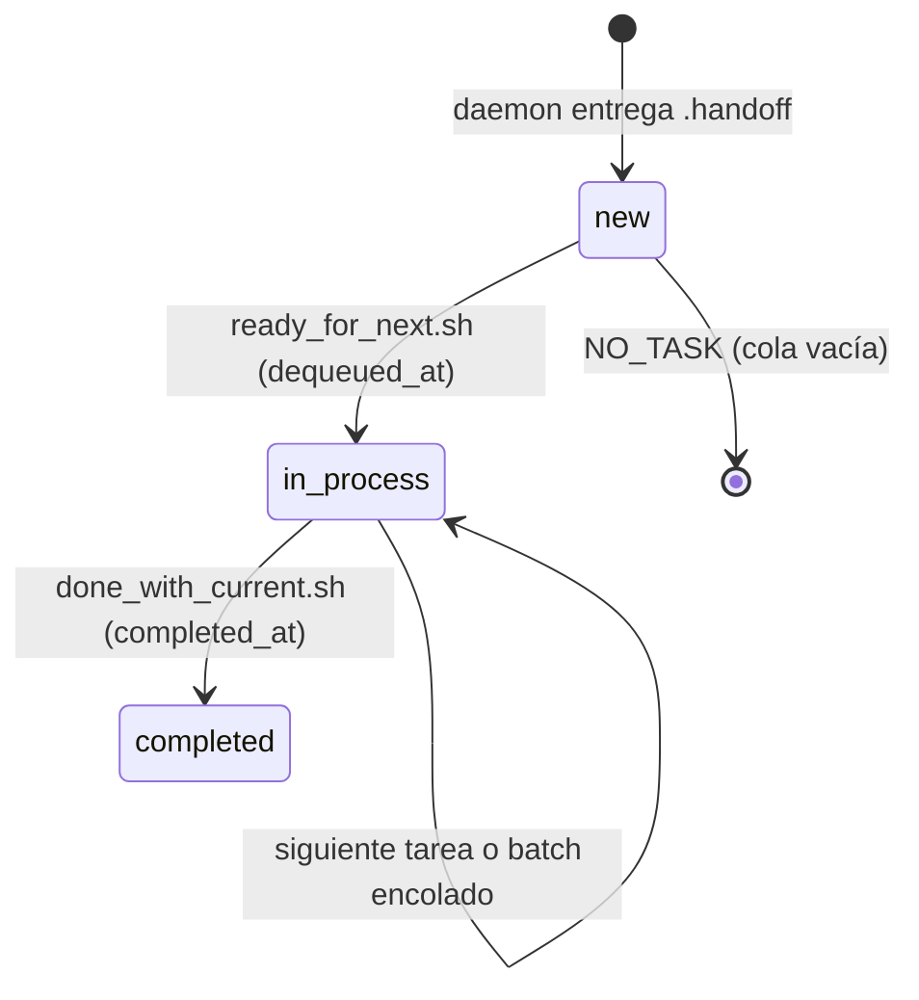

# SwarmForge — Protocolo de handoff y pipeline determinista

> Documento de trabajo complementario a `swarmforge.md`.
> Ejemplo basado en el workflow completo de `six-pack` (specifier → coder → cleaner → architect → hardender → QA).

---

## 1. Semántica del handoff (ejemplo completo)

**Tarea**: *"Implementar un carrito de compra con cálculo de impuestos"* → nombre de tarea estable: **`cart-tax`**. Ese nombre viaja por toda la cadena sin cambiar.

### 1.1 El contrato de mensajes

Solo existen **dos tipos** de mensaje, y solo los headers que el agente puede escribir:

```text
type: git_handoff      →  "he commiteado trabajo; fusiónalo y procésalo"
to: coder
priority: 50           →  00 = urgente · 50 = normal · 99 = baja
task: cart-tax         →  nombre estable que viaja por la cadena
commit: 3f9a2c1d7e     →  hash canónico de 10 hex (el gate lo valida y canonicaliza)
```

```text
type: note             →  mensaje corto (solo si la constitución/rol lo autoriza)
to: architect
priority: 70
message: <1 línea, máx 80 chars>
```

Los agentes **nunca escriben el payload ni los headers reservados** (`id`, `from`, `role`, `recipient`, `created_at`, `enqueued_at`…): todo eso lo genera la herramienta.

### 1.2 El specifier abre la cadena

El specifier conversa contigo, escribe `features/cart.feature` (Gherkin) + la suite QA end-to-end, y **te pide aprobación explícita**. Solo después de tu OK commitea y escribe su draft:

```text
type: git_handoff
to: coder
priority: 50
task: cart-tax
commit: 3f9a2c1d7e
```

Ejecuta `swarm_handoff.sh draft` → el **gate de validación** hace 4 comprobaciones: `coder` es un rol conocido, `50` es prioridad válida, el commit **resuelve a exactamente un objeto y es un commit** (vía `git rev-parse --disambiguate`), y no hay campos reservados ni cuerpo escrito por el agente. Genera el payload y lo instala atómicamente en el outbox:

```text
50_20260710T120000Z_000042_from_specifier_to_coder.handoff
```

El **daemon** (polling 1 s) copia el archivo al `inbox/new/` del coder **añadiendo headers de entrega**, y despierta al coder tecleando en su pane de tmux: *"You have new handoff mail. If idle, run ready_for_next.sh."* + Enter.

El archivo entregado (esto es lo que el coder ve):

```text
id: 20260710T120000Z_000042_from_specifier
from: specifier
to: coder
recipient: coder            ← añadido por el daemon (copia por destinatario)
priority: 50
type: git_handoff
role: specifier
task: cart-tax
commit: 3f9a2c1d7e
created_at: 2026-07-10T12:00:00Z
enqueued_at: 2026-07-10T12:00:01Z  ← añadido por el daemon

Re-read your role and constitution.

merge_and_process specifier 3f9a2c1d7e
```

### 1.3 El coder consume la tarea

El coder ejecuta `ready_for_next.sh` → el helper mueve el archivo de `inbox/new/` a `inbox/in_process/`, **añade `dequeued_at`**, e imprime:

```text
TASK: .swarmforge/handoffs/inbox/in_process/50_..._from_specifier_to_coder.handoff
FROM: specifier
TYPE: git_handoff
PRIORITY: 50
TASK_NAME: cart-tax
PAYLOAD:
Re-read your role and constitution.

merge_and_process specifier 3f9a2c1d7e
```

El coder hace `merge_and_process specifier 3f9a2c1d7e` (merge del commit de la especificación), aplica **TDD** (tests unitarios primero, luego implementación), corre los acceptance tests generados desde el Gherkin, commitea con byline (*"Implement cart tax" — `By coder.`*) y **reenvía a la cadena** con el mismo `task: cart-tax` y su nuevo commit. Regla clave: **un rol intermedio SIEMPRE reenvía**, pase lo que pase (aunque el cambio sea solo de formato).

### 1.4 El cleaner en modo batch

El cleaner está configurado en `swarmforge.conf` con `batch`. Si llegan 3 handoffs del coder de la misma prioridad, `ready_for_next_batch.sh` los agrupa:

```text
BATCH: .swarmforge/handoffs/inbox/in_process/batch_20260710T130000Z_000051
COUNT: 3
PRIORITY: 50
BATCH_ITEM: 1  → TASK_NAME: cart-tax ...
BATCH_ITEM: 2  → TASK_NAME: user-auth ...
BATCH_ITEM: 3  → TASK_NAME: cart-coupon ...
```

Procesa los 3 como **una pasada de limpieza**: coverage, CRAP ≤ 6, DRY, scan de sitios de mutación (divide ficheros con >100 sitios), acceptance + unit tests, commitea, y reenvía **una vez** al architect.

### 1.5 La cadena sigue (architect → hardender → QA)

Cada uno con la misma mecánica: `ready_for_next.sh` (task o batch) → procesa su gate → verifica → commitea con byline → reenvía a la cadena con `task: cart-tax` preservado.

### 1.6 QA cierra: el "terminal broadcast"

Cuando QA verifica todo (suite e2e por UI, consistencia de commits/manifiestos, CRAP/DRY final), commitea y envía **un único handoff a múltiples destinatarios** con `priority: 00`:

```text
type: git_handoff
to: specifier,coder,cleaner,architect,hardender
priority: 00
task: cart-tax
commit: b4d8e2f1a0
```

Esta es la **excepción a la regla de reenvío**: cada receptor hace `merge_and_process QA b4d8e2f1a0`, corre sus tests, y **NO reenvía**. El specifier, al recibir el broadcast, fusiona y te pregunta por la siguiente feature. Cadena cerrada.

### 1.7 La máquina de estados de cada tarea

```text
inbox/new/ ──ready_for_next──► inbox/in_process/ ──done_with_current──► inbox/completed/
   (entrega del daemon)         (+dequeued_at)        (+completed_at)
```

- `done_with_current.sh` **recoge la siguiente tarea o batch automáticamente** si hay cola → los agentes no se quedan ociosos.
- Si un wake-up llega mientras el agente trabaja → **se ignora**; la cola no se pierde porque el estado vive en archivos.
- Reinicio del swarm → los agentes re-ejecutan `ready_for_next.sh` y reanudan desde `in_process`.

---

## 2. Las reglas para un pipeline determinista

El determinismo no sale de un solo sitio: sale de **cuatro capas de reglas** que se refuerzan mutuamente.

### 2.1 Capa 1 — Reglas compartidas (constitución)

**`workflow.prompt`** (disciplina de trabajo):

- Cada rol trabaja **solo en su worktree/branch asignado**; prohibido difflinear/fusionar branches ajenos salvo handoff explícito.
- Todo commit lleva byline: `By <rol>.`
- Archivos temporales en `./tmp/` del worktree, no en `/tmp`.
- Si el layout git esperado no existe → **parar y reportar**, no improvisar.

**`handoffs.prompt`** (protocolo):

- Solo `git_handoff` y `note`; las notes requieren autorización explícita.
- Ante ambigüedad/contradicción → **parar y preguntar**, no mandar notes.
- **Reenvío de cadena obligatorio**: cada rol intermedio reenvía a la siguiente etapa tras completar, incluso si el cambio es no-funcional (formato, manifiestos, metadatos).
- **Broadcast terminal = merge-only**: los receptores del handoff final no reenvían.
- `task:` se preserva al reenviar; se inventa un nombre estable solo para trabajo nuevo.
- Prohibido editar/añadir/commitear el estado runtime de handoffs.

**`engineering.prompt`** (reglas técnicas):

- TDD: tests unitarios primero, luego producción mínima para pasar.
- Las herramientas de calidad (mutation/CRAP/DRY/coverage) solo corren sobre **módulos testeables**; los módulos "ambientalmente inadecuados" quedan como adapters excluidos.
- Acceptance vía `gherkin-parser` (APS) — prohibido reimplementar el parser.
- Verificación local antes de cada handoff; comandos de verificación nunca concurrentes entre sí.
- Guardrails: no editar manifiestos de mutation a mano; no commitear artefactos no relacionados.

### 2.2 Capa 2 — Reglas por rol (six-pack)

| Rol | Owns | **Does Not Own** (frontera) | Verificación antes de handoff | Obligación de handoff |
|---|---|---|---|---|
| **specifier** | Gherkin + acceptance criteria + suite QA e2e | No corre mutation ni quality tools | Tests si hace falta; **nada más** | **No commitea ni reenvía sin tu aprobación**. Tras tu OK: commit + handoff al coder con `task:` inventado |
| **coder** | Implementación de slices aprobados con TDD | QA suite, mutation, CRAP/DRY, Gherkin mutation | Unit tests + acceptance tests | Commit + handoff al cleaner |
| **cleaner** (batch) | Limpieza preservando comportamiento: nombres, duplicación, boundaries, cobertura | Mutation tests, Gherkin mutation, **nuevo comportamiento** | CRAP ≤ 6, DRY, scan de sitios de mutation, acceptance + unit | Commit + handoff al architect **antes de tomar otra tarea/batch** |
| **architect** (batch) | Estructura, boundaries, dirección de dependencias, hardening de mutation, DRY, property tests | — (hereda la cadena) | Mutation por fichero (diferencial), DRY, property tests, Gherkin soft | Commit + handoff al hardender |
| **hardender** (batch) | Mutation hardening (matar supervivientes), Gherkin mutation, CRAP/DRY final | Suite QA e2e del specifier | Mutation → Gherkin soft → CRAP → DRY | Commit + handoff a QA |
| **QA** (batch) | Verificación final independiente, convertir QA suite en scripts ejecutables, e2e por UI | Mutation y Gherkin mutation | Suite e2e por UI, consistencia de handoffs/manifiestos, CRAP/DRY | Commit + **broadcast priority 00 a todos** (merge-only) |

### 2.3 Capa 3 — Reglas del transporte (el gate)

- `swarm_handoff.sh` **rechaza** drafts con: campos reservados, roles desconocidos, prioridad no numérica (00–99), commits ambiguos o no-commits, `task` > 80 chars, cuerpos escritos por el agente. El agente repara y reintenta; nada malformado entra en la cola.
- Prioridades: **50** = avance normal de cadena, **00** = broadcast terminal / trabajo urgente de seguimiento. La cola ordena por `prioridad_timestamp_secuencia`, así el orden es **determinista aunque lleguen en el mismo segundo**.
- Los roles `batch` consumen **todos los handoffs de igual prioridad como una unidad** → el cleaner/reviewer no interrumpe su pasada por cada entrega.
- Los agentes **no hablan con tmux**: el daemon es el único con acceso al socket; los agentes solo escriben archivos en su outbox. El canal de control y el canal de estado están separados.

### 2.4 Capa 4 — Reglas del estado (la cola como máquina de estados)

- `new → in_process → completed` con timestamps de auditoría (`enqueued_at`, `dequeued_at`, `completed_at`).
- **Reanudación**: el estado vive en archivos, no en memoria — reinicias el swarm y `ready_for_next.sh` reanuda desde `in_process`.
- `done_with_current.sh` **encadena la siguiente tarea** automáticamente → el pipeline avanza sin intervención humana entre gates.

### 2.5 De dónde sale el determinismo (resumen)

1. **Tipos de mensaje cerrados** (2) y **gate de validación estricto** → nada ambiguo entra en el sistema.
2. **Reenvío de cadena obligatorio** + **broadcast merge-only** → el orden de procesamiento es siempre el mismo, sin saltos ni bucles.
3. **Fronteras de propiedad** ("Does Not Own") → cada agente solo toca lo suyo; nadie pisa el trabajo del otro (el coder no hace mutation; el cleaner no introduce comportamiento).
4. **Verificación obligatoria antes de cada handoff** → un handoff solo existe si su gate pasó.
5. **Aislamiento por worktree** → cada rol ve solo su branch; el merge ocurre explícitamente vía `merge_and_process` en el momento del handoff.
6. **Nombre de tarea estable + prioridad + secuencia** → trazabilidad total: puedes seguir `cart-tax` de commit en commit por toda la cadena.

---

## 3. Diagramas

### 3.1 Pipeline completo (seis roles, `six-pack`)



### 3.2 Cadena de handoffs y prioridades



### 3.3 Ciclo de vida de una tarea



---

## 4. Notas de sintaxis mermaid (validado con v11.13.0)

- En mensajes de `sequenceDiagram` no usar entidades `&lt;`/`&gt;` — usar backticks: `` `<commit>` ``.
- En labels de `flowchart` no usar comillas dobles escapadas (`\"`) — usar comillas simples internas o texto plano.
- `<br/>` sí funciona dentro de mensajes de secuencia y labels.
