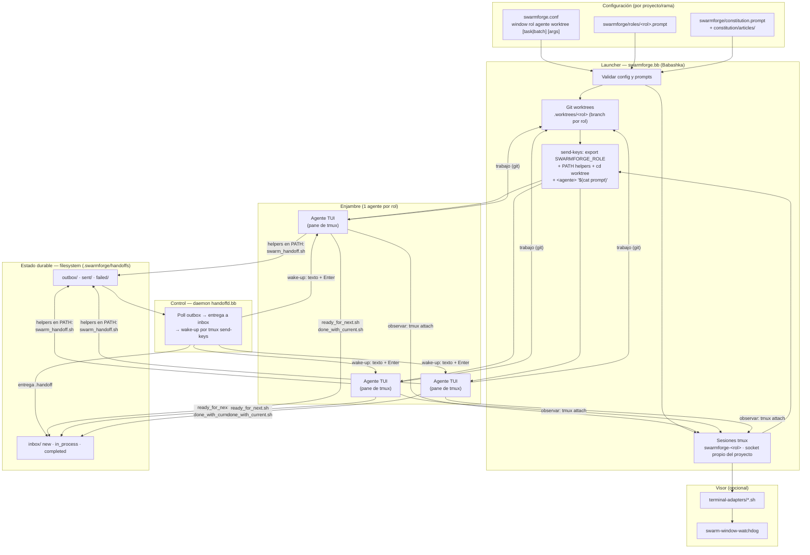
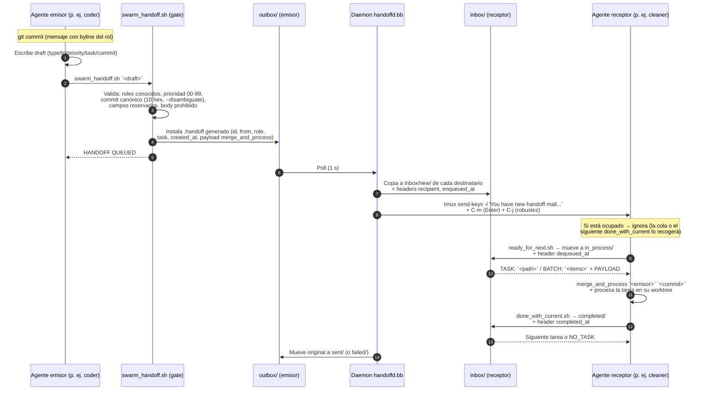
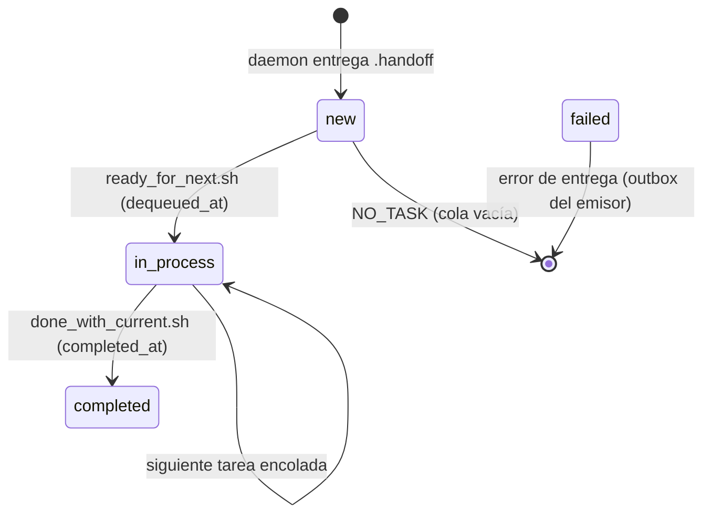

# SwarmForge — Descripción, protocolo y requisitos de migración

> Documento de trabajo. Fuente del proyecto: https://github.com/unclebob/swarm-forge
> Objetivo: entender la arquitectura de SwarmForge y evaluar su adaptación a **pi** como agente, sobre **Linux**, con modelos **DeepSeek / GLM / Qwen**.

---

## 1. Descripción del proyecto

**SwarmForge** es una plataforma de orquestación de agentes basada en **tmux** que convierte un enjambre de agentes de IA en un equipo de ingeniería de software coordinado. Fue creada por Robert C. Martin y aplica su propia disciplina de ingeniería (TDD, Gherkin/acceptance testing, mutation testing, análisis CRAP/DRY) al problema de coordinar agentes.

Idea central: **cada agente vive en su propio git worktree y en su propia sesión tmux**, y los agentes se comunican mediante un **protocolo de handoff por archivos** entregado por un daemon. No hay mensajes directos entre agentes ni acceso directo al socket de tmux por parte de ellos.

### Estructura de ramas

| Rama | Descripción | Roles |
|---|---|---|
| `main` | **Documental**: scripts operativos compartidos + artículos de constitución por defecto | — |
| `two-pack` | Workflow backend rápido (TDD + hardening, sin Gherkin) | `coder` → `cleaner` → `coder` |
| `four-pack` | Workflow compacto con especificación Gherkin | `specifier` → `coder` → `refactorer` → `architect` → `specifier` |
| `six-pack` | Workflow completo con todos los quality gates separados | `specifier` → `coder` → `cleaner` → `architect` → `hardender` → `QA` → fin |

Cada rama ejecutable contiene la configuración del proyecto: `swarmforge.conf` (topología), `roles/<rol>.prompt` (prompts por rol) y `constitution.prompt` + artículos (reglas compartidas). En el arranque, el wrapper `./swarm` descarga los scripts operativos compartidos desde `main` (solo la primera vez) y lanza el orquestador.

### Cómo funciona a alto nivel

1. **Configuración declarativa**: `swarmforge.conf` define el enjambre ventana a ventana:
   ```
   window <rol> <agente> <worktree> [task|batch] [args-extra...]
   ```
2. **Launcher** (`swarmforge.bb`, Babashka): valida la config, inicializa el repo git si hace falta, crea un **worktree por rol** bajo `.worktrees/`, crea una **sesión tmux por rol** en un socket propio del proyecto y lanza cada agente con su prompt inicial.
3. **Agentes**: cada uno corre como TUI interactivo en su pane de tmux, dentro de su worktree, con los scripts de handoff en su `PATH`.
4. **Daemon** (`handoffd.bb`): dueño del socket tmux. Vigila los outboxes de los agentes, entrega los handoffs a los inboxes de los destinatarios y despierta a los agentes con un mensaje tecleado en su pane.
5. **Protocolo de handoff**: los agentes crean drafts validados, los reciben como tareas o lotes (`task`/`batch`), y reportan completitud con `done_with_current.sh`.
6. **Visor opcional**: adaptadores de terminal (`terminal-adapters/*.sh`) abren una ventana por rol para observación en tiempo real, con watchdog que reabre ventanas cerradas sin perder estado del agente.

### Características clave

- **Topología config-driven**: la forma del enjambre sale de `swarmforge.conf`, no del código.
- **Roles por proyecto**: `swarmforge/roles/<rol>.prompt` por rama/backlog.
- **Constitución en capas**: `constitution.prompt` dirige a los agentes a leer artículos bajo `swarmforge/constitution/articles/` (reglas de ingeniería, handoffs y workflow compartidas + reglas locales por rama).
- **Backends por rol**: cada rol puede usar un agente CLI distinto (`claude`, `codex`, `copilot`, `grok`).
- **Observable**: una ventana de terminal por rol, o headless en tmux.
- **Self-hosted y ligero**: solo requiere tmux, git, zsh y Babashka; todo el estado vive en `.swarmforge/` dentro del proyecto.
- **Robustez operativa**: prevención de sleep del host (`caffeinate`/`systemd-inhibit`), reanudación de tareas tras reinicio, auditoría por archivos (`new` → `in_process` → `completed`).

---

## 2. Protocolo de handoff (resumen)

El protocolo separa **estado** (archivos en el filesystem, durable y auditable) de **control** (tmux, solo para notificación y liveness).

### Mensajes

Solo dos tipos, ambos estrictamente validados:

```
type: git_handoff          type: note
to: <rol>[,<rol>...]       to: <rol>[,<rol>...]
priority: NN (00-99)       priority: NN (00-99)
task: <nombre-estable>     message: <1 línea, máx 80 chars>
commit: <10 hex>
```

- `git_handoff`: el emisor ha commiteado trabajo; el receptor hace `merge_and_process <rol> <commit>`.
- `note`: mensaje corto; solo cuando la constitución o el rol lo autorizan explícitamente.

### Flujo

1. El agente commitea y escribe un **draft** con solo headers.
2. `swarm_handoff.sh` es la **puerta de validación**: rechaza campos reservados, roles desconocidos, prioridades inválidas, commits ambiguos (canonicaliza el hash con `git rev-parse --disambiguate`) y cuerpos que no sean generados.
3. El helper genera el payload (`id`, `from`, `role`, `task`, `created_at`, body) y lo instala atómicamente en `outbox/`.
4. El **daemon** hace polling (1s), copia el handoff al `inbox/new/` de cada destinatario (añadiendo `recipient` y `enqueued_at`) y despierta al receptor.
5. El receptor ejecuta `ready_for_next.sh` → mueve a `inbox/in_process/` (añade `dequeued_at`) e imprime `TASK:`/`BATCH:` con el payload.
6. Al completar, `done_with_current.sh` mueve a `inbox/completed/` (añade `completed_at`) y recoge la siguiente tarea si existe.
7. El daemon mueve el original del emisor a `sent/` o `failed/`.

### Wake-up (plano de control)

El daemon "despierta" a un agente tecleando en su pane de tmux:

```
tmux send-keys -t <sesión> -l "You have new handoff mail. If idle, run ready_for_next.sh."
tmux send-keys -t <sesión> C-m    # Enter
tmux send-keys -t <sesión> C-j    # LF de robustez
```

El agente lo recibe como un mensaje de usuario. Reglas del protocolo: si ya está trabajando, **ignora el wake-up**; `done_with_current.sh` recoge la siguiente tarea al terminar. En la práctica, un agente con cola de mensajes (como pi) encola el wake-up y lo entrega al terminar el turno.

### Reglas de cadena

- Los roles intermedios **siempre reenvían** un `git_handoff` al siguiente rol de la cadena, pase lo que pase (aunque el cambio sea no funcional).
- El handoff final de la cadena (broadcast) es **merge-only**: los destinatarios fusionan y no reenvían.
- Los nombres de tarea (`task:`) se preservan a lo largo de la cadena.

---

## 3. Requisitos de migración

### 3.1 Contrato de agente (condición necesaria)

SwarmForge exige que el agente sea un **proceso interactivo de larga vida en un pane de tmux** que cumpla:

1. **CLI interactivo (TUI/REPL)** que se mantenga corriendo — los wake-ups llegan como texto tecleado + Enter; un CLI one-shot no puede recibir trabajo.
2. **Prompt inicial por línea de comandos** (o inyectable por `tmux send-keys` tras el arranque).
3. **Trabajo en el directorio del worktree** (`cd <worktree> && <agente> ...`).
4. **Capacidad de ejecutar comandos** (los helpers `swarm_handoff.sh`, `ready_for_next.sh`, `done_with_current.sh` son shell/bb en el `PATH` — son agnósticos del modelo).

Todo lo demás del protocolo (handoffs, worktrees, daemon, wake-ups, watchdog) **no conoce al modelo**: el único punto de integración es el arm de lanzamiento en `swarmforge.bb` y la lista de backends validados en `parse-config`.

### 3.2 Validación: pi como agente

**Encaja de fábrica.** Verificado en docs y binario instalado:

- `pi "<prompt>"` arranca la TUI, **envía el mensaje inicial y se queda interactivo** (confirmado en `dist/modes/interactive/interactive-mode.js`).
- **tmux soportado oficialmente** (`docs/tmux.md`). Recomendación: tmux ≥ 3.5 con `extended-keys-format csi-u` para teclas modificadas; el protocolo básico (Enter) funciona con cualquier versión.
- **Wake-up compatible**: en pi `Enter` = enviar, `Ctrl+J` = nueva línea (el `C-j` del daemon es inofensivo).
- **Message queue**: un mensaje tecleado mientras pi trabaja se **encola y se entrega al terminar el turno** — ideal para la semántica de wake-up del protocolo.
- **Sesiones**: `pi -c` (continuar), `--session`, `--name "SwarmForge <Rol>"` (nombre de sesión).

Requisitos operativos con pi:

| Requisito | Detalle |
|---|---|
| Trust prompt | pi pregunta al arrancar en un proyecto nuevo y **bloquearía al agente**. Usar `-a/--approve` en el arm de lanzamiento o pre-sembrar `~/.pi/agent/trust.json`. |
| Modelo fijado | Usar `--model <provider>/<modelo>` para que cada rol no arranque en el selector de login. |
| Runtime | Node.js ≥ 22 (instalación npm) o script standalone; Linux soportado nativamente. |

Arm de lanzamiento propuesto en `swarmforge.bb`:

```clojure
"pi" (str "pi -a --name " (sq (str "SwarmForge " display))
           " --model " (sq model) " "
           (extra-args-prefix row)
           "\"$(cat " (sq (str prompt-file)) ")\"")
```

### 3.3 Validación: opencode como agente

**Encaja con una adaptación obligatoria.** Verificado en el binario real v1.18.15 y en el fuente:

- `opencode` (sin args) arranca la **TUI interactiva** persistente.
- ⚠️ La TUI **no acepta mensaje inicial por CLI**: `--prompt` en modo TUI llama a un `rl.question` de Node (espera input por stdin); solo `--mini --prompt` lo envía como mensaje, pero con `interactive: false` (ejecuta y sale). `opencode run "<msg>"` es **headless one-shot** — no sirve como agente del swarm.
- **Solución**: lanzar la TUI (`opencode --auto`) e **inyectar el prompt con `tmux send-keys`** tras el arranque — el mismo mecanismo que el daemon ya usa para despertar. Son ~10 líneas en `launch-role!` (lanzar → sleep → `send-keys -l "$(cat prompt)"` + Enter).

```
opencode --auto -m <provider>/<modelo>    # en la sesión tmux del rol
# tras ~2s:
tmux send-keys -t <target> -l "<prompt inicial>" ; tmux send-keys -t <target> C-m
```

Requisitos operativos con opencode:

| Requisito | Detalle |
|---|---|
| Permisos | `--auto` (auto-approve; también existen los aliases ocultos `--yolo` / `--dangerously-skip-permissions`) — equivalente al modo autónomo del swarm. |
| Sesiones | `-c/--continue`, `-s/--session` para el flujo de reinicio ("on restart, run ready_for_next.sh"). |
| Runtime | Binario estático (npm `opencode-ai` o release de GitHub); Linux soportado. |
| A futuro | `opencode serve` + `attach`/SDK/ACP permitirían una cola de mensajes nativa sin wake-ups por teclado (requeriría cambiar la arquitectura, no adaptarla). |

### 3.4 Modelos: DeepSeek / GLM / Qwen

| Modelo | pi | opencode |
|---|---|---|
| **DeepSeek** | **Nativo**: `DEEPSEEK_API_KEY`, provider `deepseek`, `--model deepseek/...` | **Nativo** en catálogo (`models.dev`): `deepseek-*` |
| **Qwen** | **Nativo**: `QWEN_TOKEN_PLAN_API_KEY`, providers `qwen-token-plan` / `-individual` / `-cn` (China) | **Nativo**: `qwen3.x-*`, `alibaba-*/qwen*` |
| **GLM (Zhipu)** | **No nativo**: requiere extensión de provider custom (OpenAI-compatible, `api: "openai-completions"`, `thinkingFormat: "zai"`) o proxy OpenAI-compatible | **Nativo**: `glm-4.x`/`glm-5.x` (`opencode-go/glm-*`, `alibaba-*/glm-*`) |

Observación: pi ya implementa los formatos de *thinking* de las tres familias (`thinkingFormat: "deepseek" | "zai" | "qwen"` en `docs/custom-provider.md`), lo que simplifica la integración de GLM: solo hay que registrar el endpoint y los modelos con esa extensión.

### 3.5 Linux (runtime)

| Requisito | Estado | Detalle |
|---|---|---|
| `zsh` | **Requisito duro** | Los scripts usan `#!/usr/bin/env zsh`. Arch: `pacman -S zsh`. |
| `tmux` | Requisito | Recomendado ≥ 3.5 (pi con teclas extendidas). |
| `git` | Requisito | Worktrees y protocolo de commits. |
| Babashka (`bb`) | Requisito | El launcher y todos los helpers están en Babashka (cross-platform). |
| Node.js ≥ 22 | Solo pi | Instalación npm de pi (o script standalone). |
| Terminal | **Headless funciona** | Por defecto en Linux (sin `osascript`/`wt.exe`) el launcher cae a `none`: adjunta el shell actual a la sesión del primer rol y el resto queda detached (`tmux -S <socket> attach -t swarmforge-<rol>`). El enjambre funciona completo sin ventanas. |
| Ventanas automáticas (opcional) | Por construir | Escribir un `terminal-adapters/wezterm.sh` (o kitty) para Linux: contrato de 5 funciones (~40 líneas). WezTerm es el más scripteable (`wezterm cli`); Ghostty en Linux no tiene control remoto. |
| Apagado | Prever | El script `close-swarm` vive en la rama `main`; las ramas ejecutables no lo llevan — copiarlo al proyecto o usar el apagado por "cerrar la primera ventana". |
| Prevención de sleep | Funciona | `systemd-inhibit` en Linux (systemd en ejecución). Desactivar con `SWARMFORGE_PREVENT_SLEEP=0`. |

### 3.6 Cambios de código necesarios (mínimos)

En `swarmforge/scripts/swarmforge.bb` (la rama de trabajo, p. ej. `four-pack`):

1. **`parse-config`**: añadir el backend a la lista validada, p. ej. `#{"claude" "codex" "copilot" "grok" "pi"}`.
2. **`launch-command`**: añadir el arm del nuevo backend (pi: sección 3.2; opencode: sección 3.3).
3. **`check-backend-dependencies!`**: sin cambios — ya comprueba que el binario exista en `PATH`.

En la config del proyecto:

- `swarmforge.conf`: `window coder pi master` (o `opencode`), con `[task|batch]` y args extra según rol.

Opcionales según objetivo:

- Artículos de constitución compartidos en `swarmforge/constitution/articles/` de la rama (el wrapper solo los *stages* en `scripts/shared-articles/`; conviene confirmar que los agentes leen los que la rama necesita).
- Adaptador de terminal Linux (sección 3.5).
- `close-swarm` en el proyecto.

---

## 4. Diagrama de arquitectura



## 5. Diagrama del protocolo (ciclo de un handoff)



### Ciclo de vida de una tarea en el inbox



---

## 6. Resumen ejecutivo

1. **La arquitectura es agnóstica del modelo**: el único punto de integración de un backend nuevo es el arm de lanzamiento + la lista de backends validados en `swarmforge.bb`; el protocolo de handoff, worktrees, daemon y wake-ups no conocen al agente.
2. **pi encaja directamente**: mensaje inicial interactivo por CLI, tmux soportado, cola de mensajes alineada con la semántica de wake-up, DeepSeek/Qwen nativos y GLM con una extensión pequeña.
3. **opencode encaja con una adaptación**: la TUI no acepta prompt inicial por CLI → inyección por `tmux send-keys` tras el arranque (mecanismo ya existente en el sistema). DeepSeek/GLM/Qwen nativos.
4. **Linux es ciudadano de primera clase por diseño**: el enjambre vive en tmux, no en ventanas; headless funciona completo. Las ventanas automáticas son solo un adaptador de terminal opcional.
5. **Requisitos mínimos**: zsh + tmux (≥3.5 recomendado) + git + Babashka + (Node.js para pi) + ~15 líneas de cambios en `swarmforge.bb` + config de providers.
